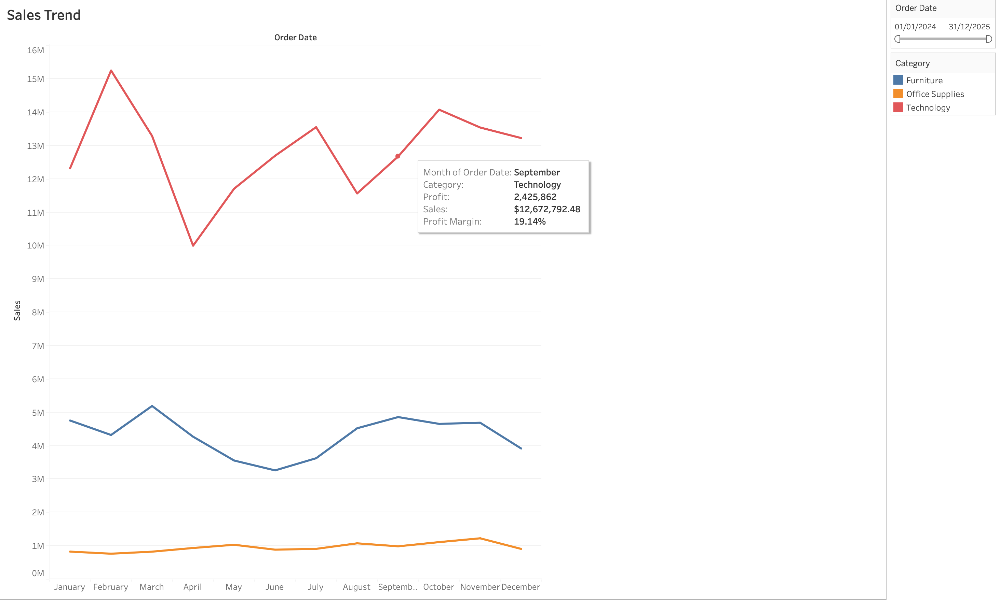
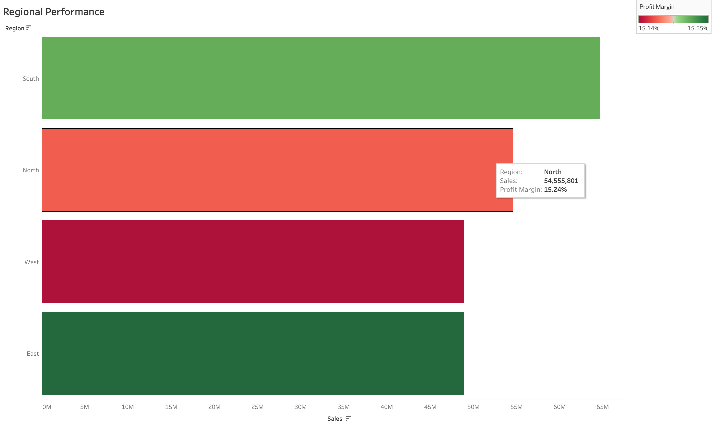
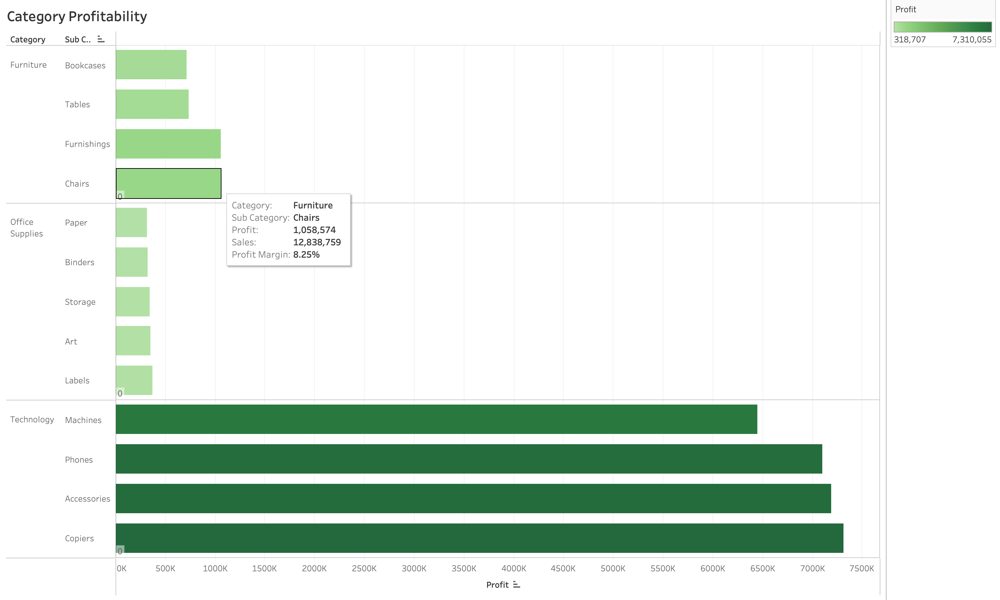
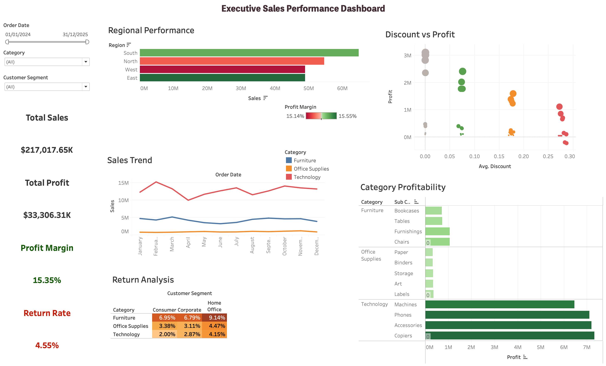
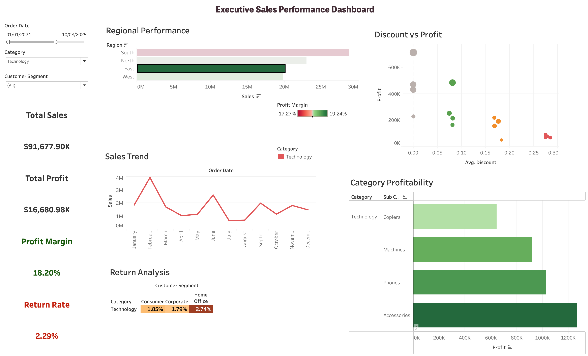

# Part 4: Tableau Executive Dashboard and Data Storytelling


## Business Problem Summary

The retail leadership team needs an executive dashboard to monitor sales performance, profitability, customer segments, product category performance, shipping performance, discount impact, and return patterns.

The dashboard is designed to help leadership answer five core business questions:

1. Are sales and profit performing well overall?
2. Which regions are strongest or weakest?
3. Which categories and sub-categories are driving profit?
4. Are discounts reducing profitability?
5. Where are return risks visible?

The final Tableau dashboard is not only a set of charts. It connects sales, profit, margin, returns, discount behavior, and regional performance into one decision-making view.

## Required Folder Structure

The repository should follow this structure:

```text
part4_tableau_dashboard/
├── data/
│   └── dashboard_sales_data.xlsx
├── tableau/
│   └── executive_dashboard.twbx
├── outputs/
│   ├── dashboard_story.md
│   ├── business_insights.md
│   └── chart_selection_justification.md
├── screenshots/
│   ├── full_dashboard.png
│   ├── sales_trend_view.png
│   ├── regional_performance_view.png
│   ├── category_profitability_view.png
│   └── filter_interaction_view.png
└── README.md
```

## Dataset Description

The dataset used for this dashboard is `dashboard_sales_data.xlsx`.

Dataset link : `https://drive.google.com/drive/folders/1mxNI7AbZDPux5wBEgmteatTRtJSrkrev`

The main data sheet contains 4,200 order-level records covering the period from 01 January 2024 to 31 December 2025.

Key fields used in the analysis:

| Field | Type | Use in Dashboard |
|---|---|---|
| `order_id` | Categorical identifier | Count of orders and return calculations |
| `order_date` | Date | Sales trend and dashboard date filter |
| `ship_date` | Date | Shipping timeline reference |
| `customer_id` | Categorical identifier | Customer/order-level analysis |
| `customer_segment` | Categorical | Segment comparison and dashboard filter |
| `region` | Geographic/categorical | Regional performance and dashboard action |
| `state` | Geographic/categorical | Supporting geographic field |
| `city` | Geographic/categorical | Supporting geographic field |
| `category` | Categorical | Product category analysis and dashboard filter |
| `sub_category` | Categorical | Category profitability detail |
| `product_name` | Categorical | Product-level reference |
| `ship_mode` | Categorical | Shipping performance analysis |
| `sales` | Numeric measure | Revenue KPI and charts |
| `quantity` | Numeric measure | Order/product volume context |
| `discount` | Numeric measure | Discount impact analysis |
| `profit` | Numeric measure | Profit KPI and profitability charts |
| `return_flag` | Binary flag | Return rate and return analysis |
| `delivery_days` | Numeric measure | Shipping delay analysis |
| `customer_rating` | Numeric measure | Customer experience context |
| `campaign_channel` | Categorical | Optional marketing channel filter or analysis |

## Tableau Workbook Description

The Tableau packaged workbook is saved as:

```text
tableau/executive_dashboard.twbx
```

The workbook contains:

1. One executive dashboard.
2. Required supporting Tableau worksheets.
3. Calculated fields for profit, cost, return, discount, and shipping analysis.
4. Interactive filters.
5. A dashboard action where selecting a region filters the other dashboard views.

## Task-Wise Implementation Summary

### Task 1: Connect and Inspect Data

The Excel dataset was connected to Tableau using the `dashboard_sales_data` sheet.

The fields were inspected and categorized as follows:

1. Date fields:
   - `order_date`
   - `ship_date`

2. Geographic fields:
   - `region`
   - `state`
   - `city`

3. Categorical fields:
   - `order_id`
   - `customer_id`
   - `customer_segment`
   - `category`
   - `sub_category`
   - `product_name`
   - `ship_mode`
   - `campaign_channel`

4. Numerical measures:
   - `sales`
   - `quantity`
   - `discount`
   - `profit`
   - `delivery_days`
   - `customer_rating`

5. Binary/flag field:
   - `return_flag`, where `1` indicates a returned order and `0` indicates a non-returned order.

Assumption:

`return_flag` was treated as a binary order-level return indicator. Each row represents one order record, so distinct `order_id` was used for order counts.

### Task 2: Create Calculated Fields

The following calculated fields were created in Tableau.

#### Profit Margin

```text
SUM([profit]) / SUM([sales])
```

Purpose:

Measures profitability as a percentage of sales.

#### Cost

```text
[sales] - [profit]
```

Purpose:

Estimates cost by subtracting profit from sales.

#### Average Order Value

```text
SUM([sales]) / COUNTD([order_id])
```

Purpose:

Measures average sales value per distinct order.

#### Return Rate

```text
COUNTD(IF [return_flag] = 1 THEN [order_id] END) / COUNTD([order_id])
```

Purpose:

Calculates the percentage of orders that were returned.

#### Shipping Delay Bucket

```text
IF [delivery_days] <= 2 THEN "Fast: 0-2 days"
ELSEIF [delivery_days] <= 5 THEN "Moderate: 3-5 days"
ELSEIF [delivery_days] <= 8 THEN "Delayed: 6-8 days"
ELSE "Severely Delayed: 9+ days"
END
```

Purpose:

Groups delivery time into business-friendly delay categories.

#### Returned Orders

```text
COUNTD(IF [return_flag] = 1 THEN [order_id] END)
```

Purpose:

Counts returned orders.

#### Total Orders

```text
COUNTD([order_id])
```

Purpose:

Counts total distinct orders.

#### Discount Band

```text
IF [discount] = 0 THEN "No Discount"
ELSEIF [discount] <= 0.10 THEN "Low Discount"
ELSEIF [discount] <= 0.20 THEN "Medium Discount"
ELSE "High Discount"
END
```

Purpose:

Groups discount levels for easier interpretation.

#### Profit Status

```text
IF SUM([profit]) >= 0 THEN "Profitable"
ELSE "Loss Making"
END
```

Purpose:

Classifies whether the selected level of analysis is profitable.

### Task 3: Create Required Tableau Sheets

The workbook includes the required views:

| Required View | Purpose | Chart Used |
|---|---|---|
| Sales Trend | Shows sales trend over time | Line chart |
| Regional Performance | Shows sales and profit margin by region | Horizontal bar chart |
| Category Profitability | Shows category and sub-category profit | Horizontal bar chart |
| Customer Segment View | Compares sales and profit by segment | Bar chart |
| Shipping Performance View | Shows shipping mode and delivery delay impact | Bar chart |
| Discount vs Profit | Shows relationship between discount and profit | Scatter plot using circle marks |
| Return Analysis | Shows return rate by category and customer segment | Highlight table |

### Task 4: Use Appropriate Chart Types

The chart types were selected based on the business question:

1. A line chart was used for sales over time because time-series changes are easier to read as lines.
2. A horizontal bar chart was used for regional performance because regions are categorical and need direct comparison.
3. A horizontal bar chart was used for category profitability because it supports clear profit ranking by sub-category.
4. A scatter plot was used for discount vs profit because the purpose is to show the relationship between discount level and profitability.
5. A highlight table was used for return analysis because return rate risk is easier to scan using color intensity.

### Task 5: Build Executive Dashboard

The final dashboard is titled:

```text
Executive Sales Performance Dashboard
```

Dashboard components:

1. KPI cards:
   - Total Sales
   - Total Profit
   - Profit Margin
   - Return Rate

2. Main dashboard charts:
   - Regional Performance
   - Sales Trend
   - Discount vs Profit
   - Category Profitability
   - Return Analysis

3. Interactive filters:
   - Order Date
   - Category
   - Customer Segment
   - Region

4. Dashboard action:
   - Selecting a region in the Regional Performance chart filters the other dashboard views.

The dashboard uses a left-side control panel for filters and KPIs, with analytical charts placed in the main area.

### Task 6: Apply Visualization Design Principles

The dashboard applies the following visualization principles:

1. Clear hierarchy:
   - Filters and KPIs are placed on the left.
   - Main analytical charts are placed in the central and right sections.

2. Minimal clutter:
   - Only five major charts are shown on the executive dashboard.
   - Supporting views remain available in the workbook.

3. Consistent colors:
   - Green is used for stronger profitability.
   - Red is used for weaker profitability or return risk.
   - Category colors are kept consistent in the sales trend view.

4. Appropriate chart selection:
   - Line chart for trend.
   - Bar charts for category and region comparisons.
   - Scatter plot for discount-profit relationship.
   - Highlight table for return rate.

5. Business-friendly labels:
   - Chart titles use plain business terms such as `Regional Performance`, `Sales Trend`, and `Return Analysis`.

### Task 7: Capture Required Screenshots

The required screenshots should be saved in the `screenshots/` folder:

| Screenshot | Required Content |
|---|---|
| `full_dashboard.png` | Complete executive dashboard |
| `sales_trend_view.png` | Sales trend line chart |
| `regional_performance_view.png` | Regional sales/profit performance |
| `category_profitability_view.png` | Category and sub-category profit chart |
| `filter_interaction_view.png` | Dashboard after selecting a region or applying a filter action |

For the final dashboard screenshot, Tableau menus and worksheet tabs should not be visible. The screenshot should show only the dashboard.

### Task 8: Write Business Insights

Business insights are documented in:

```text
outputs/business_insights.md
```

The insights cover:

1. Sales trend
2. Regional performance
3. Category and sub-category profitability
4. Customer segment behavior
5. Discount impact
6. Shipping and delivery performance
7. Return pattern
8. Business risk and opportunity

### Task 9: Write Dashboard Story

The leadership-level dashboard story is documented in:

```text
outputs/dashboard_story.md
```

The story connects overall KPIs, regional performance, category profitability, discount risk, return risk, and recommended next actions.

### Task 10: Explain Chart Selection

Chart selection decisions are documented in:

```text
outputs/chart_selection_justification.md
```

Each major chart is explained by:

1. Business question answered.
2. Reason for chart type.
3. Fields used for color, size, label, or filter.
4. Design principle applied.
5. Mistake avoided.

## Calculated Fields

The following calculated fields were created in Tableau.

#### Profit Margin

```text
SUM([profit]) / SUM([sales])
```

Purpose:

Measures profitability as a percentage of sales.

#### Cost

```text
[sales] - [profit]
```

Purpose:

Estimates cost by subtracting profit from sales.

#### Average Order Value

```text
SUM([sales]) / COUNTD([order_id])
```

Purpose:

Measures average sales value per distinct order.

#### Return Rate

```text
COUNTD(IF [return_flag] = 1 THEN [order_id] END) / COUNTD([order_id])
```

Purpose:

Calculates the percentage of orders that were returned.

#### Shipping Delay Bucket

```text
IF [delivery_days] <= 2 THEN "Fast: 0-2 days"
ELSEIF [delivery_days] <= 5 THEN "Moderate: 3-5 days"
ELSEIF [delivery_days] <= 8 THEN "Delayed: 6-8 days"
ELSE "Severely Delayed: 9+ days"
END
```

Purpose:

Groups delivery time into business-friendly delay categories.

#### Returned Orders

```text
COUNTD(IF [return_flag] = 1 THEN [order_id] END)
```

Purpose:

Counts returned orders.

#### Total Orders

```text
COUNTD([order_id])
```

Purpose:

Counts total distinct orders.

#### Discount Band

```text
IF [discount] = 0 THEN "No Discount"
ELSEIF [discount] <= 0.10 THEN "Low Discount"
ELSEIF [discount] <= 0.20 THEN "Medium Discount"
ELSE "High Discount"
END
```

Purpose:

Groups discount levels for easier interpretation.

#### Profit Status

```text
IF SUM([profit]) >= 0 THEN "Profitable"
ELSE "Loss Making"
END
```

Purpose:

Classifies whether the selected level of analysis is profitable.

## Dashboard components

1. KPI cards:
   - Total Sales
   - Total Profit
   - Profit Margin
   - Return Rate

2. Main dashboard charts:
   - Regional Performance
   - Sales Trend
   - Discount vs Profit
   - Category Profitability
   - Return Analysis

3. Interactive filters:
   - Order Date
   - Category
   - Customer Segment

4. Dashboard action:
   - Selecting a region in the Regional Performance chart filters the other dashboard views.

The dashboard uses a left-side control panel for filters and KPIs, with analytical charts placed in the main area.


## Filters And Interactions Used

The dashboard includes the following interactive filters:

| Filter | Purpose |
|---|---|
| Order Date | Allows users to analyze performance within a selected date range |
| Category | Allows users to focus on Furniture, Office Supplies, or Technology |
| Customer Segment | Allows users to compare Consumer, Corporate, and Home Office behavior |
| Region | Allows users to focus on a specific regional market |

The dashboard also includes a filter action:

| Interaction | Description |
|---|---|
| Regional Performance click action | When a user selects a region in the Regional Performance chart, the other dashboard views update to show only data for that selected region |

This interaction helps leadership move from a high-level regional comparison into a focused view of sales trend, category profitability, discount impact, and return patterns for the selected region.


## Key Business Insights Summary

1. Total sales are approximately `$217.02M`.
2. Total profit is approximately `$33.31M`.
3. Overall profit margin is `15.35%`.
4. Overall return rate is `4.55%`.
5. Technology is the strongest category by profit, contributing approximately `$28.04M`.
6. South is the highest-sales region, with approximately `$64.69M` in sales.
7. High-discount orders have a much lower profit margin than no-discount or low-discount orders.
8. Furniture has the highest return risk among categories, with a return rate of approximately `7.67%`.
9. Home Office is the highest-sales customer segment, but it also has the highest return rate.
10. Standard Class has the longest average delivery time among shipping modes.

## Dashboard Story Summary

The business is profitable overall, with strong total sales and a positive profit margin. Technology products are the major profit driver, while Furniture requires closer review because it has lower margin and higher return risk. Regionally, South leads in sales, while East shows a slightly stronger profit margin. Discounting appears to reduce profitability, especially for high-discount orders. Return risk is concentrated more heavily in Furniture and Home Office customers, which should be reviewed for product quality, customer expectations, and fulfillment issues.

## Assumptions and Limitations

1. `return_flag = 1` means the order was returned.
2. Each row is treated as an order-level record.
3. `Profit Margin` is calculated as total profit divided by total sales.
4. `Average Order Value` is calculated using distinct order count.
5. Shipping delay is based on the `delivery_days` field already provided in the dataset.
6. Missing values in `customer_rating` and `campaign_channel` were not removed because these fields are not central to the main executive dashboard.
7. The dashboard is based only on the provided historical data from 2024 and 2025.
8. The analysis does not include external market conditions, inventory constraints, customer acquisition cost, or competitor pricing.

## Screenshots included

###  Sales trend chart



###  Regional performance



###  Category/sub-category profitability



###  Complete executive dashboard




###  Evidence of filter or dashboard interaction


